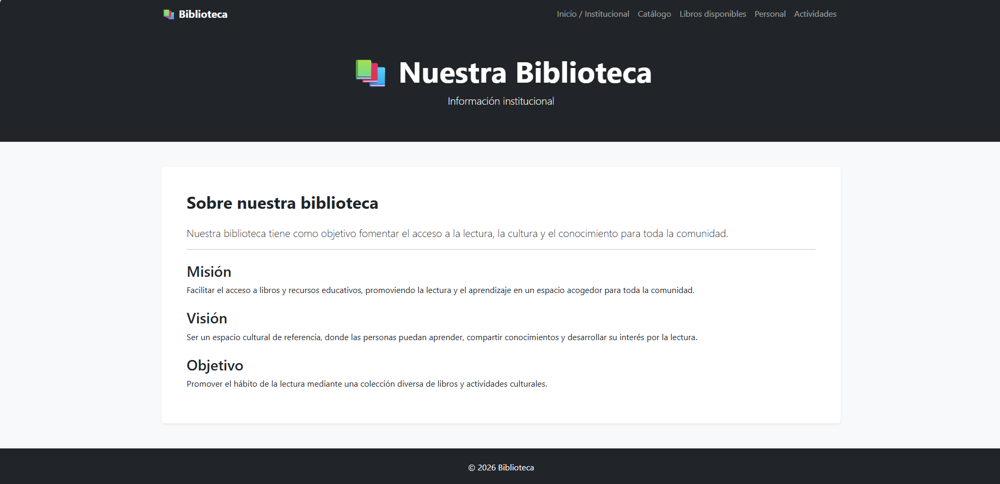

# 📚 Biblioteca Django - Sistema de Gestión y Catálogo

Sistema web institucional y de gestión para una biblioteca, desarrollado con **Python**, **Django** y **Bootstrap 5**. El proyecto implementa un flujo completo de gestión con una interfaz limpia, minimalista y responsive, además de un sistema de autenticación de usuarios para asegurar las operaciones administrativas.

## ✨ Características Principales

*   📊 **Dashboard Principal (`/`)**: Panel de control centralizado con métricas clave (total de libros, libros disponibles y total de autores) y accesos directos.
*   📖 **Catálogo de Libros**: Listado público de libros.
*   👥 **Módulo de Autores**: Visualización y registro de autores asociados a la biblioteca.
*   🔒 **Sistema de Autenticación (Login/Logout)**: Control de sesiones integrado utilizando el sistema nativo de Django.
*   🛡️ **Seguridad en Operaciones CRUD**: Las vistas de Creación, Edición y Eliminación están protegidas mediante decoradores (`@login_required`), permitiendo que los usuarios anónimos solo tengan permisos de lectura.

---

## 🛠️ Tecnologías Utilizadas

*   **Backend**: Python 3.13, Django 4.2
*   **Base de Datos**: MySQL (XAMPP)
*   **Frontend**: HTML5, CSS3, Bootstrap 5, Google Fonts

---

## 📂 Estructura del Sitio

*   **Inicio (`/`)**: Dashboard general con estadísticas y accesos rápidos.
*   **Catálogo de Libros (`/catalogo/`)**: Tabla con los libros registrados, códigos, géneros, años, estados y autor.
*   **Autores (`/autores/`)**: Listado de autores registrados en el sistema.
*   **Acceso (`/accounts/login/`)**: Inicio de sesión exclusivo para administradores y personal autorizado.

---

## 🚀 Instalación y Puesta en Marcha

1. **Clonar el repositorio:**
git clone [https://github.com/bellybelly21/biblioteca-django.git](https://github.com/bellybelly21/biblioteca-django.git)
cd biblioteca-django
   
2. **Crear y activar un entorno virtual:**
python -m venv venv
# En Windows:
venv\Scripts\activate

3. **Instalar dependencias:**
pip install django

4. **Aplicar migraciones a la base de datos:**
python manage.py makemigrations
python manage.py migrate

5. **Crear un superusuario (para acceder a las funciones de creación, edición y eliminación):**
python manage.py createsuperuser

6. **Ejecutar el servidor de desarrollo:**
python manage.py runserver

Luego, ingresa desde tu navegador a: http://127.0.0.1:8000/

🎯 Objetivo
El objetivo del proyecto es desarrollar una aplicación web funcional utilizando Django, superando el panel de administración tradicional para ofrecer una interfaz pública respaldada por un sistema seguro de autenticación de sesiones y gestión de datos relacionales (Libros y Autores).

📄 Licencia
Proyecto desarrollado con fines académicos y educativos.

